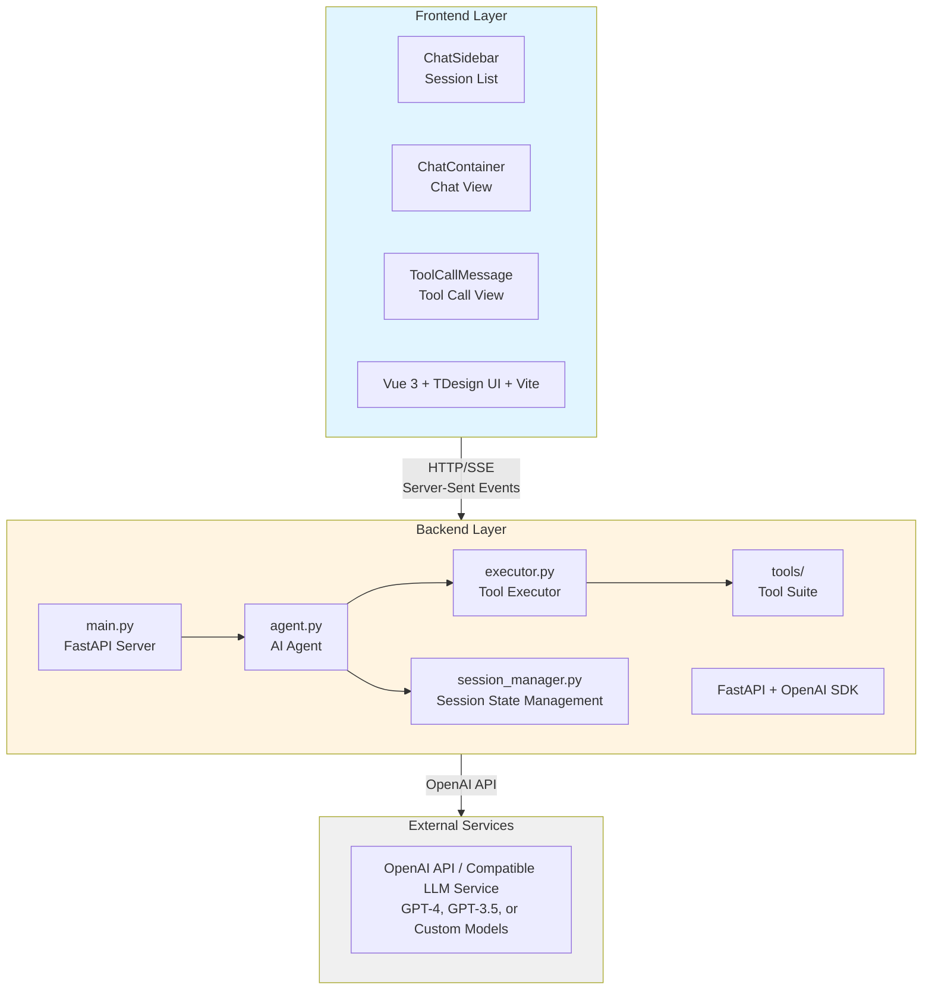
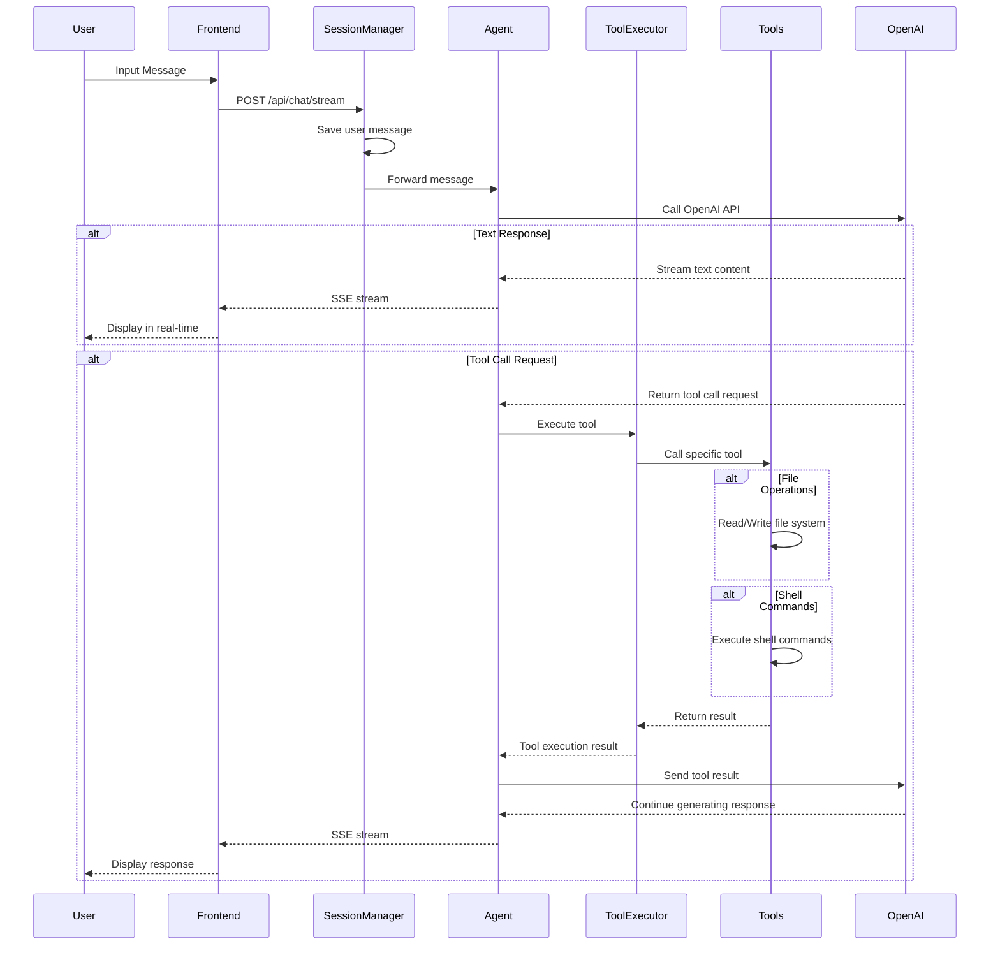

# IriBot - Lightweight AI Agent Chat System

A full-featured AI agent application with tool calling capabilities and real-time conversation experience. Built with Python FastAPI backend + Vue 3 frontend full-stack architecture.

## 🚀 Quick Start

- Install: `pip install iridet-bot`
- Find an empty directory for the agent, and run: `iribot`
- Fill out `.env`, then run `iribot` again.
- To specify host and port: `iribot --host 0.0.0.0 --port 8080`
- (Optional, Recommended) Copy some skills to `skills` directory

## ✨ Key Features

### 🤖 AI Agent Conversation

- Streaming responses for real-time replies (SSE)
- Image input support (vision-capable models)
- System prompt generation with current time and available tools/skills

### 🛠️ Tool Calling System

The agent can autonomously call tools to complete tasks:

- **File Operations**
  - `read_file` - Read file contents
  - `write_file` - Create or modify files
  - `list_directory` - List directory contents

- **Command Execution**
  - `shell_start` - Start an interactive shell session
  - `shell_run` - Execute commands in shell
  - `shell_read` - Read shell output
  - `shell_write` - Write input to shell
  - `shell_stop` - Stop shell session

- **Skills**
  - `use_skill` - Load skill instructions from `skills/*/SKILL.md`

### 💬 Session Management

- Multi-session support with persistent history (stored under `./sessions`)
- Session list management (create, switch, delete)

### 🎨 Frontend Experience

- UI built on TDesign + @tdesign-vue-next/chat
- Markdown rendering and KaTeX math support
- Tool call status display in chat

## 🏗️ System Architecture



### Data Flow



## 🚀 Install from Source

### Requirements

- Python 3.9+
- Node.js 16+
- OpenAI API Key (or compatible LLM service)

### Option A: Install from PyPI

```bash
pip install iridet-bot
```

Run the server in an empty working directory:

```bash
iribot
```

On first run, the app copies `iribot/.env.example` into your current working directory as `.env` and exits. Edit `.env`, then run `iribot` again.

Open `http://localhost:8000` in your browser. The backend serves the bundled UI from the static assets directory.

### Option B: Local Development

#### 1. Clone the Repository

```bash
git clone <repository-url>
cd mybot
```

#### 2. Backend Setup

```bash
# Create virtual environment (recommended)
python -m venv venv
source venv/bin/activate  # Windows: venv\Scripts\activate

# Install dependencies
pip install -e .

# Initialize .env
cp iribot/.env.example .env  # Windows: copy iribot\.env.example .env
# Edit .env file and add your OpenAI API Key
```

#### 3. Frontend Setup (Vite Dev Server)

```bash
cd frontend
npm install
npm run dev
```

By default, the dev server runs on port `3009` and proxies `/api` to `http://localhost:8009`.

#### 4. Start Backend

```bash
iribot --reload --port 8009
```

If you prefer port `8000`, update `frontend/vite.config.js` to point to `http://localhost:8000`.

## 🔧 Configuration

### Backend Configuration

Configuration is read from `.env` in your current working directory.

| Config Item       | Description                        | Default                |
| ----------------- | ---------------------------------- | ---------------------- |
| `OPENAI_API_KEY`  | OpenAI API key                     | Required               |
| `OPENAI_MODEL`    | Model to use                       | `gpt-4-vision-preview` |
| `OPENAI_BASE_URL` | Custom API endpoint                | Empty (use official)   |
| `DEBUG`           | Debug mode                         | `false`                |
| `SHELL_TYPE`      | Shell type (`auto`, `bash`, `cmd`) | `auto`                 |
| `BASH_PATH`       | Bash executable path               | `bash`                 |

### Frontend Configuration

Frontend connects to backend via Vite proxy. Configure in `frontend/vite.config.js`.

## 🔌 API Endpoints

### Session Management

- `POST /api/sessions` - Create new session
- `GET /api/sessions` - Get session list
- `GET /api/sessions/{session_id}` - Get session details
- `DELETE /api/sessions/{session_id}` - Delete session

### Chat Interface

- `POST /api/chat/stream` - Send message (SSE streaming response)

### Tool Status

- `GET /api/tools/status` - Get all tool statuses

### Prompt Generation

- `POST /api/prompt/generate` - Generate system prompt (JSON)
- `GET /api/prompt/generate` - Generate system prompt (JSON)
- `GET /api/prompt/text` - Generate system prompt (plain text)
- `GET /api/prompt/current` - Get current system prompt (plain text)

### Health

- `GET /api/health` - Health check

## 🛠️ Extension Development

### Adding New Tools

1. Create a new tool file in the `iribot/tools/` directory
2. Inherit from `BaseTool` class:

```python
from tools.base import BaseTool

class MyCustomTool(BaseTool):
    @property
    def name(self) -> str:
        return "my_custom_tool"

    @property
    def description(self) -> str:
        return "Tool description"

    @property
    def parameters(self) -> dict:
        return {
            "type": "object",
            "properties": {
                "param1": {
                    "type": "string",
                    "description": "Parameter description"
                }
            },
            "required": ["param1"]
        }

    def execute(self, **kwargs) -> dict:
        # Implement tool logic
        return {
            "success": True,
            "result": "Execution result"
        }
```

3. Register the tool in `executor.py`:

```python
def _register_default_tools(self):
    # ... other tools
    self.register_tool(MyCustomTool())
```

### Adding New Frontend Components

Add new UI components under `frontend/src/components/`.

## 📝 Tech Stack

### Backend

- **FastAPI** - Modern, fast web framework
- **OpenAI SDK** - LLM interface calling
- **Pydantic** - Data validation and settings management
- **Uvicorn** - ASGI server

### Frontend

- **Vue 3** - Progressive JavaScript framework
- **TDesign** - UI component library
- **@tdesign-vue-next/chat** - Chat UI components
- **Vite** - Frontend build tool
- **Marked** - Markdown parser
- **KaTeX** - Math rendering

## 🤝 Contributing

Issues and Pull Requests are welcome!

## 📄 License

MIT License

## 🔗 Related Links

- [OpenAI API Documentation](https://platform.openai.com/docs)
- [FastAPI Documentation](https://fastapi.tiangolo.com/)
- [Vue 3 Documentation](https://vuejs.org/)
- [TDesign Documentation](https://tdesign.tencent.com/vue-next/overview)

---

**Note:** Using this project requires a valid OpenAI API Key or compatible LLM service endpoint.
