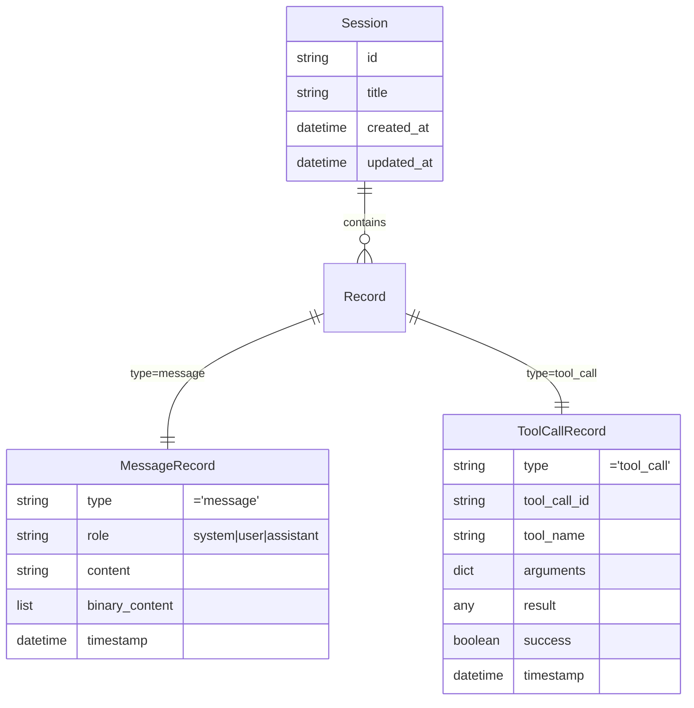
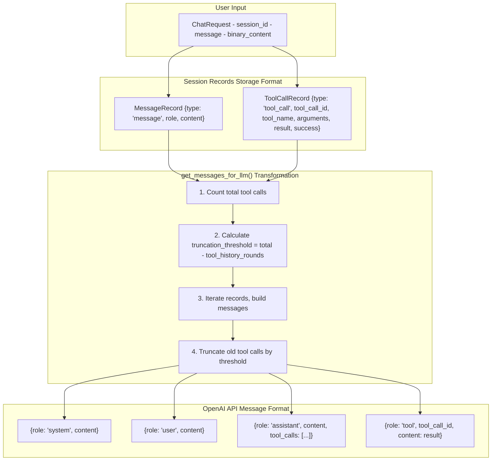
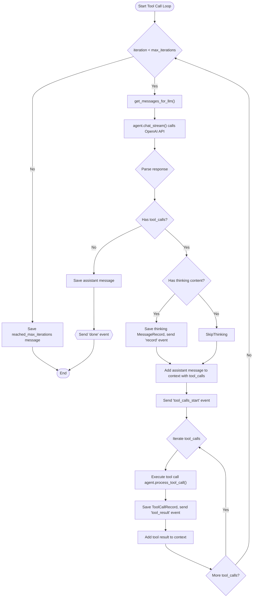
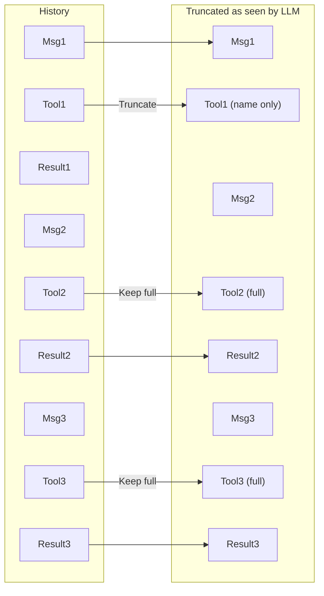
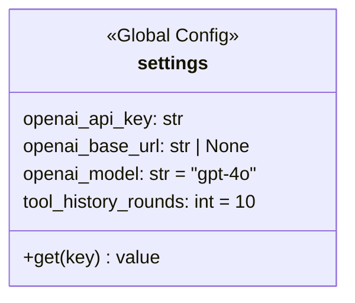
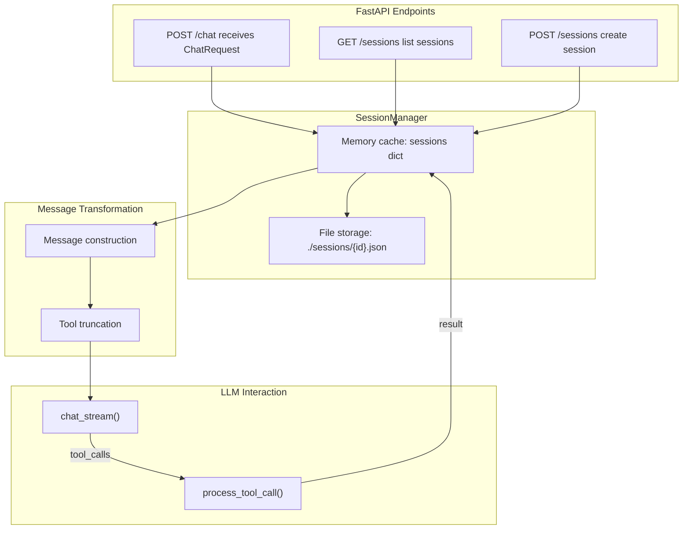

# Data Structure Flowchart

## Core Data Structures

## Message Flow Transformation Process

## Tool Call Loop Process

## Tool Call Truncation Logic

Assume `tool_history_rounds = 3`:

## Configuration Parameters

## Data Flow Overview

